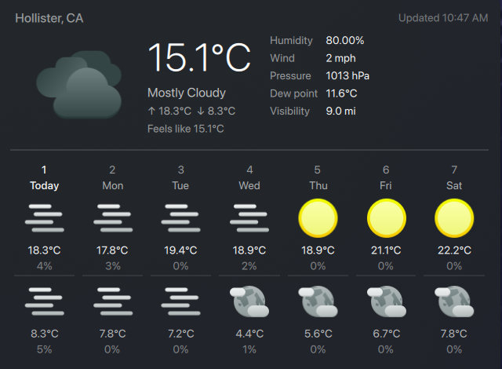

# kde-weather-widget



A KDE Plasma 6 applet that shows current weather in the system tray and detailed conditions in the popup.

The default provider is **Open-Meteo** (no API key), so it works out of the box after you set a location.

## Requirements

- KDE Plasma 6
- For `weather.gov` provider: a US location (NWS coverage)
- Optional: OpenWeatherMap API key if you use OWM provider

## Quick start (step by step)

1. Install the widget files:
   ```sh
   git clone https://github.com/murrain/kde-weather-widget.git
   cd kde-weather-widget
   rsync -a com.weatherstation.local/ ~/.local/share/plasma/plasmoids/com.weatherstation.local/
   kbuildsycoca6
   ```
2. Add **Weather Station** from Plasma's widget picker.
3. Right-click the widget -> **Configure**.
4. Keep provider as **Open-Meteo (No API key)**.
5. Search for your city, select it, then close the config dialog.

## Update existing install

```sh
git pull
rsync -a com.weatherstation.local/ ~/.local/share/plasma/plasmoids/com.weatherstation.local/
kbuildsycoca6
plasmashell --replace & disown
```

If Plasma doesn't pick up the update immediately, log out/in or restart `plasmashell`.

---

## More details

### Features

- Tray icon + current temperature
- Expanded popup with current condition, feels-like, humidity, wind, pressure, visibility, and 7-day forecast
- Multiple providers:
  - Open-Meteo (default, no API key)
  - weather.gov (US National Weather Service, no API key)
  - OpenWeatherMap One Call 3.0
  - OpenWeatherMap One Call 2.5 (legacy)
  - Custom OWM-compatible URL
- Configurable units and decimal precision
- Configurable refresh interval
- Error handling for invalid config, network errors, timeouts, and API errors

## Configuration

### General tab

- **API provider**: Choose provider preset. `weather.gov` uses NWS public APIs via your selected coordinates.
- **API key**: Shown only for providers that require a key.
- **API endpoint**: Shown only for custom URL provider.
- **Location search**: Available for providers that support geocoding (set location before running provider test).
- **Manual coordinates**: Set lat/lon directly.
- **Override display name**: Optional popup header override.
- **Refresh interval**: 1-60 minutes.
- **Use 24-hour time**: Controls the "Updated" timestamp format (default: enabled).
- **Temperature/Humidity decimal places**.
- **Debug layout**: visual layout diagnostics.

### Units tab

- Temperature: `C`, `F`, `K`
- Wind speed: `m/s`, `km/h`, `mph`, `knots`
- Pressure: `hPa`, `inHg`, `mmHg`
- Visibility: `km`, `mi`

### Error handling behavior

The widget shows actionable errors for:

- Missing or invalid location coordinates
- Missing API key for key-based providers
- Unsupported weather.gov location (outside NWS coverage)
- Invalid custom endpoint URL
- Network failures and timeouts
- HTTP errors (401/403/404/429/5xx)
- Invalid or incompatible JSON payloads

### Adding or editing providers

Provider definitions are centralized in:

- `com.weatherstation.local/contents/ui/lib/Providers.js`

To add a new provider:

1. Add a new object to `list()` with `id`, `label`, `parser`, `description`, capability flags (`requiresApiKey`, `requiresEndpoint`, `requiresCoords`, `supportsGeocoding`), and `requestTemplate`.
2. If response JSON format is new, add normalization logic in `com.weatherstation.local/contents/ui/main.qml` (`normalizeWeatherData` + parser function).

Supported template tokens:

- `{lat}`
- `{lon}`
- `{apiKey}`
- `{endpoint}`

### Project layout

```text
com.weatherstation.local/
├── metadata.json
└── contents/
    ├── config/
    │   ├── main.xml
    │   └── config.qml
    └── ui/
        ├── lib/
        │   └── Providers.js
        ├── main.qml
        ├── CompactRepresentation.qml
        ├── FullRepresentation.qml
        └── config/
            ├── ConfigGeneral.qml
            └── ConfigUnits.qml
```
